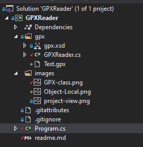

# A Quick Way to Read XML Files with a Definition File into DotNetCore Objects

This short article shows how to import complex XML/XSD files into C# classes in DotNetCore.  My motive for writing the article is there's so much poor simplistic content out there about how to (but mostly how not) do it.

[There's a Github Repository here](https://github.com/ShaunCurtis/GPXReader) to accompany this article.

To demonstrate the process I'll be importing GPX files.  These are XML formatted files.  [The detailed XSD definition is here](https://www.topografix.com/GPX/1/1/).

One look will tell you how complex and detailed the GPX standard is.  Manually building and testing classes to handle all the possibilities is a pretty mammoth task.  Luckily Microsoft provide a little known tool to automate the process, buried away in the Windows SDK - *XSD.exe*.

### Building the Classes

1. Set up a bare bones DotNetCore console project (if you use Visual Studio the IDE will do some clever XSD to class associations for you).
2. Get the XSD file and add it to a subfolder - [GPX.xsd](https://www.topografix.com/GPX/1/1/gpx.xsd) - and put it in it's own folder - in this case *Gpx*.
3. Find XSD.exe.  It's the tool I talked about above.  It's in the Windows SDK - at the moment in my case its in *C:\Program Files (x86)\Microsoft SDKs\Windows\v10.0A\bin\NETFX 4.8 Tools*.
4. Open a console/powershell window, and change to the *XSD.exe* directory.
5. Run it against the xsd file.  Note I've set the output to the input directory.

```ps
.\xsd.exe "D:\Documents\GitHub\GPXReader\Gpx\gpx.xsd" /c /outputdir:"D:\Documents\GitHub\GpxReader\Gpx"
```

The result should be (I've added the separation ============= to make it clearer):

```ps
PS C:\Program Files (x86)\Microsoft SDKs\Windows\v10.0A\bin\NETFX 4.8 Tools> .\xsd.exe "D:\Documents\GitHub\GPXReader\Gpx\gpx.xsd" /c /outputdir:"D:\Documents\GitHub\GPXReader\Gpx"

==========================================================
Microsoft (R) Xml Schemas/DataTypes support utility
[Microsoft (R) .NET Framework, Version 4.8.3928.0]
Copyright (C) Microsoft Corporation. All rights reserved.
Writing file 'D:\Documents\GitHub\GPXReader\Gpx\gpx.cs'.

===========================================================
PS C:\Program Files (x86)\Microsoft SDKs\Windows\v10.0A\bin\NETFX 4.8 Tools>
```

In the project you should now see:


Don't be tempted into a renaming exercice (I don't like those class names!).  Think about the maintainence process if the definition gets updated.

### Import Code

My simple Importer Class looks like this:

1. Use a `StreamReader` to get the import file - `XmlSerializer` wants data in streams not strings.
2. Create a new `XmlSerializer` object with the correct import type and point it to the XSD definition.
3. Run `Deserialise`, casting the result as the correct object type.

```c#
using System;
using System.IO;
using System.Xml.Serialization;

namespace GPXReader
{
    public class GPXReader
    {
        public static gpxType ReadFile(Uri url)
        {
            var gpxdata = new gpxType();
            try
            {
                using (StreamReader reader = new StreamReader(url.AbsolutePath))
                {
                    XmlSerializer serializer = new XmlSerializer(typeof(gpxType), "http://www.topografix.com/GPX/1/1");
                    gpxdata = serializer.Deserialize(reader) as gpxType;
                }
            }
            catch (Exception e)
            {
                Console.WriteLine($"An Error has occurred accessing file {url.AbsolutePath}.{Environment.NewLine} Details:{Environment.NewLine} {e.StackTrace}.");
            }
            return gpxdata;
        }
    }
}
```

I've added a fairly complex gpx file (imported from Google Maps) to the project.  Program looks like this:

```c#
using System;

namespace GPXReader
{
    class Program
    {
        static void Main(string[] args)
        {
            Console.WriteLine("GPX Reader");
            var url = new Uri($"D:/Documents/GitHub/GPXReader/gpx/Test.gpx");

            var data = GPXReader.ReadFile(url);
            // Set Break point here to view the imported file
            Console.WriteLine("Complete");

        }
    }
}
```

The project looks like this:



###  Getting Output

Run the project with a breakpoint set and explore the created `data` object.


